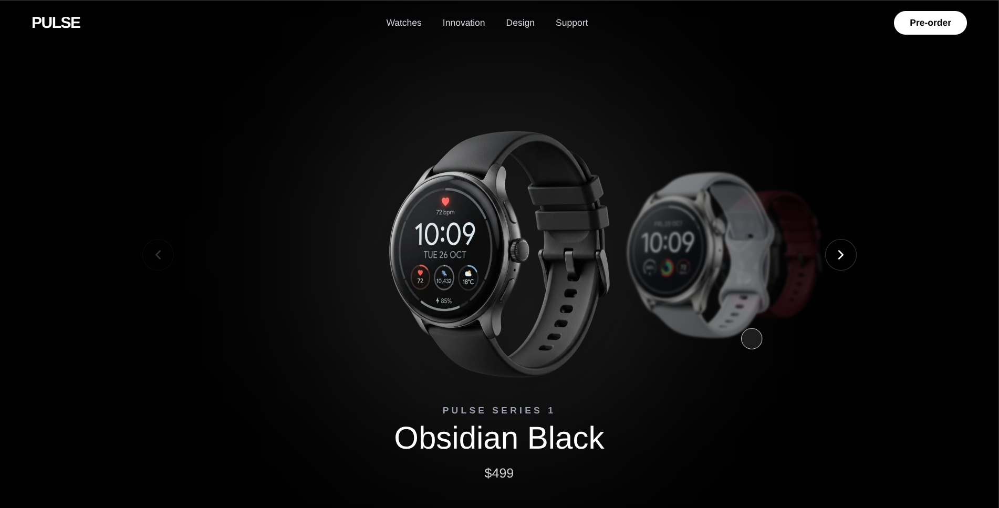

# PULSE — The Ultimate Smartwatch Experience

A **premium, immersive e-commerce web experience** built with Next.js, Tailwind CSS, and TypeScript, featuring a fully interactive colorway showcase, advanced GSAP scroll animations, and a bespoke responsive design.

---

## Features

- Interactive spotlight hero section powered by GSAP, featuring dynamic watch colorway switching that tracks mouse movement in real-time
- Custom high-performance double-ring GSAP cursor with a trailing delay effect and seamless morphing on interactive elements
- ScrollTrigger-powered storytelling sections, including text reveals, video scroll masking, and staggered highlights ("Scroll Story")
- Immersive pinned horizontal gallery with seamless layout transitions linking the sections together
- Advanced UI/UX interactions including magnetic cards and smooth smooth-scroll navigation
- Clean, modern aesthetic utilizing glassmorphism, precise typography, and a dark mode-first approach
- Fully responsive architecture — customized interaction scaling and layout adjustments across mobile, tablet, and desktop viewports

---

## Technologies Used

- **Next.js 15 (App Router)** – React framework for optimized production and routing
- **React 18** – Component-based UI architecture and hooks
- **TypeScript** – Strongly typed JavaScript for robust development
- **Tailwind CSS v4** – Utility-first styling for responsive layouts and custom design tokens
- **GSAP 3.12 + ScrollTrigger** – Advanced timeline choreography, pinning, and scroll-bound animations
- **Custom Fonts** – Geist and Geist Mono optimized via `next/font`

---

## Preview

# Pulse
